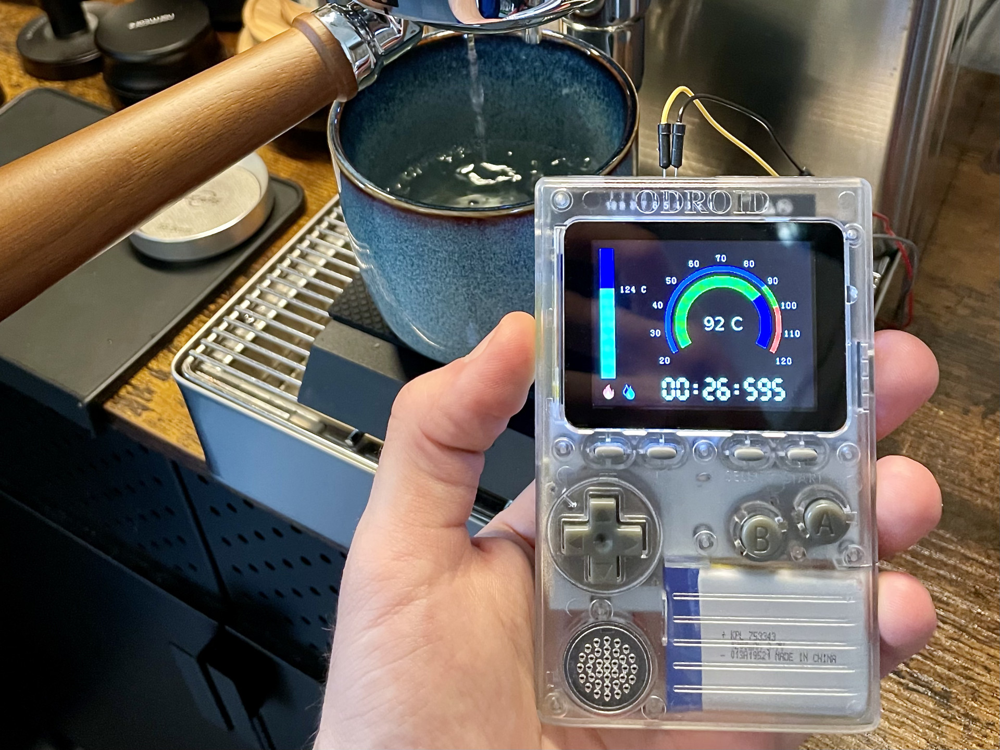

# marax-odroid-go

This repository contains a [MicroPython](https://micropython.org/) program designed to display the heat exchanger and steam boiler temperatures, along with a shot timer for the [Lelit Mara X](https://www.lelit.com/product/marax-pl62x/) espresso machine, on an [ODROID-GO](https://www.hardkernel.com/shop/odroid-go/).

## Installation Guide

1. Setup your MicroPython development environment by following the [official guide](https://wiki.odroid.com/odroid_go/micropython/01_micropython_setup_loboris).
2. Execute the `upload.sh` script to transfer all necessary files and connect to the REPL.
3. Press Ctrl+D to reboot the ODROID-GO, which will then automatically launch the program.

To establish a UART connection, connect the ODROID-GO's external Pin 5 (TX) to the Mara X's Pin 3 (RX), and the ODROID-GO's external Pin 4 (RX) to the Mara X's Pin 2 (TX).

## Hardware Requirements

* [ODROID-GO](https://www.hardkernel.com/shop/odroid-go/) - A handheld ESP32 in a GameBoy-like form factor.
* [Lelit Mara X](https://www.lelit.com/product/marax-pl62x/) - An espresso machine with UART connectivity.

## Software Dependencies

* [ESP32 MicroPython Firmware](https://github.com/loboris/MicroPython_ESP32_psRAM_LoBo)
* [ODROID-GO MicroPython Library](https://github.com/hardkernel/ODROID-GO-MicroPython/tree/loboris)